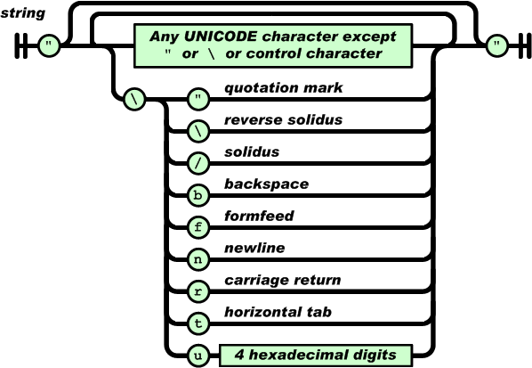

This is a simple example of how combinator parsing works in Haskell. 

> Don't use this parser in production code. You may instead want to have a look at [Aeson](https://hackage.haskell.org/package/aeson) for a mature, efficient and well-maintained JSON parsing library.

```
  build-depends:       base >=4.6, attoparsec >=0.13, text, containers
```

First, we need some imports.

```haskell
import Data.Attoparsec.Text
import Data.Text

import qualified Data.Map.Strict as H
```

Looking at [json.org](http://json.org/), we can see that a JSON value is exactly one of the following; a *string*, a *number*, an *object*, an *array*, *true*, *false*, or *null*.


> Image from [json.org](http://json.org/).

Based on this knowledge, we introduce a simple algebraic data type to represent JSON data in Haskell-land. 

```haskell
data Json = Object  !Dictionary  
          | Array   ![Json]  
          | Number  !Double 
          | String  !Text        
          | Boolean !Bool  
          | Null
    deriving (Show, Eq)
```

Most of this is straightforward. Each data constructor represents a track in the above diagram, except for Boolean, since it makes sense to combine *true* and *false* into a single constructor that accepts a native `Bool` as its argument. `Dictionary` is a type synonym for a `Map` with `Text` keys and JSON value entries, defined as

```haskell
type Dictionary = H.Map Text Json
```

We will need combinators to parse each of these separately.

```haskell
jsonString, jsonNumber, jsonBoolean, jsonNull, jsonObject, jsonArray, jsonValue :: Parser Json
```

The top-level value parser is the easiest to implement since it, by definition, should match exactly on of the other types.

```haskell
jsonValue = jsonObject
        <|> jsonArray
        <|> jsonNumber
        <|> jsonString
        <|> jsonBoolean
        <|> jsonNull
```

This type looks very similar to the railroad diagram above from the JSON specification.

### Whitespace

> Whitespace can be inserted between any pair of tokens. 

```haskell
-- | Decode JSON data with possible leading blank space.
json :: Parser Json
json = skipSpace *> jsonValue 
```

It is also useful to introduce a simple helper that translates a parser to one which ignores whitespace characters on each side of the input.

```haskell
padded :: Parser a -> Parser a
padded parser = skipSpace *> parser <* skipSpace
```

### Some helpers

```haskell
oneOf :: String -> Parser Char
oneOf = satisfy . inClass
```

```haskell
maybeOption :: Parser a -> Parser (Maybe a)
maybeOption p = option Nothing (Just <$> p)
```

### String



> Image from [json.org](http://json.org/).

```haskell
-- | Parse a string literal, i.e., zero or more characters enclosed in double quotes.
literal :: Parser Text
literal = pack <$> validChar `manyEnclosedIn` char '"' 
  where
    ... 
```

```haskell
manyEnclosedIn :: Parser a -> Parser b -> Parser [a] 
manyEnclosedIn parser encl = encl *> manyTill parser encl
```

Parsing a JSON string is now as easy as lifting the String constructor into the Parser monad and ... 

```haskell
-- | Decode a JSON string literal.
jsonString :: Parser Json
jsonString = String <$> literal 
```

```haskell
λ> :t String
String :: Text -> Json
λ> :t literal
literal :: Parser Text
λ> :t fmap String literal      -- == String <$> literal
fmap String literal :: Parser Json
```

### Number


> Image from [json.org](http://json.org/).

### Boolean

```haskell
-- | Decode a boolean.
jsonBoolean :: Parser Json
jsonBoolean = true <|> false
  where
    true  = "true"  *> return (Boolean True)
    false = "false" *> return (Boolean False)
```

### Null

```haskell
-- | Decode a null value.
jsonNull :: Parser Json
jsonNull = "null" *> return Null
```

### Object


> Image from [json.org](http://json.org/).

```haskell
keyValuePair :: Parser (Text, Json)
keyValuePair = do
    key <- literal
    padded (char ':')             -- Ignore whitespace before and after the colon
    value <- jsonValue
    return (key, value)
```

```haskell
jsonObject :: Parser Json
jsonObject = do
    char '{'
    body <- padded keyValuePair `sepBy` char ','
    char '}'
    return $ Object $ H.fromList body
  where
    keyValuePair = ...            -- See above
```

```haskell
-- | Decode a JSON object.
jsonObject :: Parser Json
jsonObject = char '{' *> pairs <* char '}'
  where
    pairs = Object . H.fromList <$> padded keyValuePair `sepBy` char ','
    keyValuePair = do
        key <- literal
        padded (char ':') 
        value <- jsonValue
        return (key, value)    
```

### Array


> Image from [json.org](http://json.org/).

Using `do`-notation, this could look something like the following.

```haskell
-- | Decode a JSON array.
jsonArray :: Parser Json
jsonArray = do
    char '['
    values <- value `sepBy` char ','
    char ']'
    return $ Array values
  where
    value = padded jsonValue
```

```haskell
jsonArray = char '[' *> (Array <$> padded jsonValue `sepBy` char ',') <* char ']'
```
