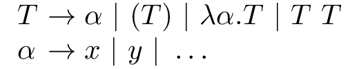
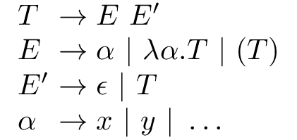

Untyped Lambda Calculus parser and interpreter.

## Parsing

In the untyped lambda calculus, a *term* is one of three things. Let T denote the set of terms, and let X be an infinite set of variables {x, y, z, ...}. Then,

* A variable is a term; x ∈ X ⇒ x ∈ T;
* Application of two terms is a term; M, N ∈ T ⇒ (M N) ∈ T; and
* A lambda abstraction is a term; x ∈ X Λ M ∈ T ⇒ (λx.M) ∈ T.

Nothing else is a term. Application is left-associative, so the term (s&nbsp;t&nbsp;u) is equivalent to ((s&nbsp;t)&nbsp;u). We often omit outermost parentheses. In abstractions, the body extends as far to the right as possible; e.g., λx.u&nbsp;v&nbsp;z&nbsp;≡&nbsp;λx.(u&nbsp;v&nbsp;z).

Here is how one can represent lambda terms in Haskell:

```haskell
data Term =
    Var !Text                -- Variable
  | App !Term !Term          -- Application
  | Lam !Text !Term          -- Lambda abstraction
  deriving (Show, Eq)
```

We will use this as the underlying type for our parser. 

```haskell
term :: Parser Term
```

Some famous expressions in the lambda calculus, represented using this data type, are 

* the identity function (λx.x);
```haskell
Lam "x" (Var "x")
```
* the Y-combinator (λf.(λx.(f (x x))) (λx.(f (x x)))); 
```haskell
Lam "f" (App (Lam "x" (App (Var "f") (App (Var "x") (Var "x")))) 
             (Lam "x" (App (Var "f") (App (Var "x") (Var "x")))))
```
* and the Church numerals (λf.λx.f x), (λf.λx.f (f x)), ...
```haskell
[ Lam "f" (Lam "x" (App (Var "f") (Var "x")))
, Lam "f" (Lam "x" (App (Var "f") (App (Var "f") (Var "x"))))
, ... ]
```

Later we will look at translation of these values into other, intermediate representation forms, more suitable for evaluation.

### Helpers

```haskell
oneOf :: String -> Parser Char
oneOf = satisfy . inClass

alphaNum :: Parser Char
alphaNum = satisfy valid
  where
    valid c = all ($ c) [ isAscii, isAlphaNum ]

parens :: Parser a -> Parser a
parens p = char '(' *> p <* char ')'
```

### Lambda abstractions

```haskell
lambda :: Parser Term -> Parser Term
lambda term = do
    oneOf "λ\\"
    name <- many1 alphaNum
    skipSpace *> char '.' <* skipSpace 
    body <- term
    return $ Lam (T.pack name) body
```

Notice that the lambda expression parser takes the parser for the abstraction body as an argument. Technically, it wouldn't be a [combinator](https://wiki.haskell.org/Combinator) otherwise. More importantly, this makes it easier to work with the function on its own &ndash; in particular since we haven't implemented the parser for the term itself yet.

We allow backslash to be used as an alias for the λ symbol. The variable name is made up of one or more alphanumeric characters. Blank space on both sides of the dot is ignored.

### Variables

To parse a variable name, we simply reuse the relevant part of our lambda parser.

```haskell
var :: Parser Term
var = do
    name <- many1 alphaNum
    return $ Var (T.pack name)
```

### Applications

The last type of term is application. Looking at the production rules for the context-free grammar of the language we are trying to describe, we have something like the following:  

<!--
T → α | (T) | λα.T | T T <br />
α → x | y | ... <br />
-->



Translating this into code,

```haskell
badterm :: Parser Term
badterm = var <|> parens badterm <|> lambda badterm <|> app

app :: Parser Term
app = do
    a <- badterm 
    skipSpace
    b <- badterm 
    return $ App a b
```

we find that &ndash; given, for example, the application x&nbsp;y, this parser will prematurely accept x before the entire input is read. We could try to fix this by placing the application parser first to give it precedence;

```haskell
badterm = app <|> var <|> parens badterm <|> lambda badterm
```

but then we end up with an infinite loop. We have a problem here with the rule T → T&nbsp;T.

#### Eliminating left recursion

A production of a context-free grammar is said to be left recursive if it has the form A&nbsp;→&nbsp;Aa. Since this is problematic for parsers, a common task is to eliminate left recursion by finding a [(weakly) equivalent](https://en.wikipedia.org/wiki/Equivalence_(formal_languages)) right-recursive grammar for the language defined by a left-recursive grammar. For instance, the language for the grammar A&nbsp;→&nbsp;Aa&nbsp;|&nbsp;B is Ba*. The right-recursive grammar for this language is

<!--
A  → BA' <br />
A' → aA' | ε <br />
-->


Going back to our language, we can express the term grammar in this form:

<!--
T → E E*            <br />
E → α | λα.T | (T)  <br />
α → x | y | ...     <br />
-->


However, to turn this into a proper grammar, we need to replace E* with a new production E'&nbsp;→&nbsp;ε&nbsp;|&nbsp;T. 

<!--
T → E E'            <br />
E → α | λα.T | (T)  <br />
E' → ε | T          <br />
α → x | y | ...     <br />
-->



We use `many1` to match one or more terms, and then fold the resulting list using the `App` constructor.

```haskell
term :: Parser Term
term = do
    terms <- many1 (skipSpace >> expr)
    return $ foldl1 App terms
  where
    expr :: Parser Term
    expr = var            -- x
       <|> lambda term    -- \x.M
       <|> parens term    -- (M)
```

## Evaluation

The `Term` type we have used so far is convenient for parsing, but it is vulnerable to a problem known as the capture problem. 

### The capture problem

There are two types of variables that can appear in a lambda term; **bound** variables and **free** variables. Let FV(t) denote the set of all free variables of the term t. Then,

* FV(x) = { x }
* FV(λx.M) = FV(M) \ { x }
* FV(M N) = FV(M) ∪ FV(N).

### De Bruijn indexing

<!-- https://en.wikipedia.org/wiki/De_Bruijn_index -->

```haskell
data Expr
  = Bound Int           -- Bound variable (depth indexed)
  | Free T.Text         -- Free variable
  | EApp Expr Expr      -- Application
  | ELam Expr           -- Lambda abstraction
  deriving (Eq, Show)
```

| Term                   | Depth-indexed       | Data type repr.                               |
|------------------------|---------------------|-----------------------------------------------|
| λx.x                   | λ[0]                | (ELam (B 0))                              |
| λy.y                   | λ[0]                | (ELam (B 0))                              |
| λx.x y                 | λ[0 y]              | (ELam (EApp (B 0) (F "y"))             |
| λx.λy.y x              | λ[λ[0 0]]           | Lam (Lam (App (B 0) (B 1)))           |
| (a b)                  | a b                 | EApp (F "a") (F "b")                    |
| (λx.(λx.(λx.x x) x) x) | λ[λ[λ[0 0] 0] 0]    | ELam (EApp (ELam (EApp (ELam (EApp (B 0) (B 0))) (B 0))) (B 0)) |
| (λx.(λy.x y) x)        | λ[λ[1 0] 0]         | ELam (EApp (ELam (EApp (B 1) (B 0))) (B 0)) |

### Beta-reduction rule


### Evaluation strategies

### REPL
